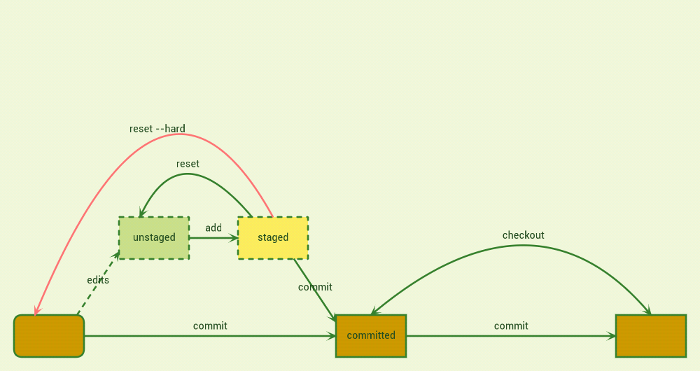
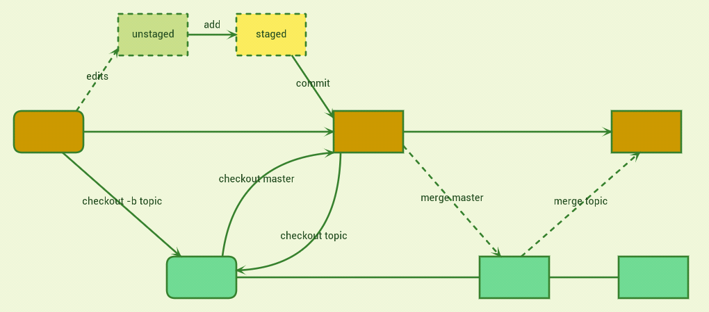
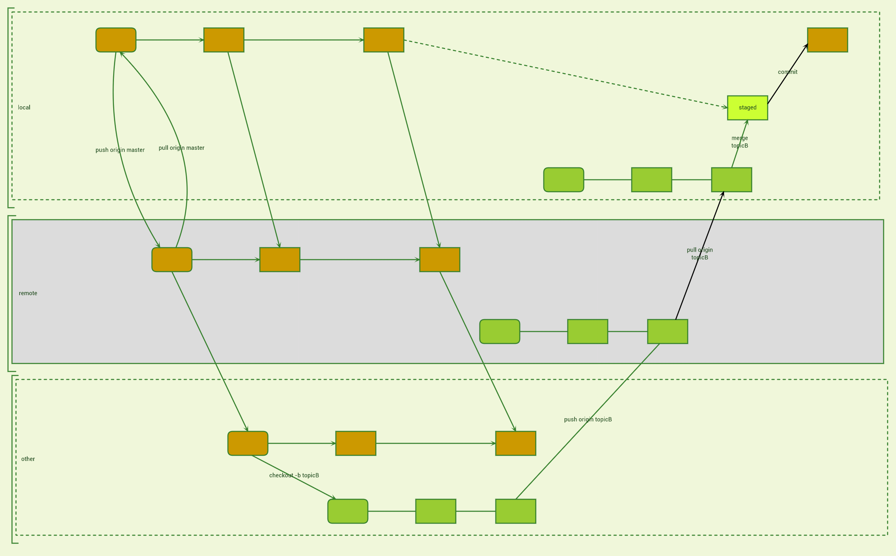

#Introduction to Git

A presentation on using Git for version control of source code and other files.
Covers beginner- to intermediate-level material.


#Outline

1. init, add, commit
2. log, status, diff
3. Branches for topics/tasks, checkout, reset (stash)
4. remote (and SSH keys), clone
5. pull, push, merge
6. pull requests


#Starting out


##Commands
```bash
init
add
commit
```


##States

- untracked
- staged
- commited


#Working Solo



##Commands
```bash
status
log
checkout
reset (--hard)
```


#Branching and topics



##Commands
```bash
branch
checkout -b
merge
```


#Collaborating



##Commands
```bash
remote
  add
  remove
branch -a
fetch
push
pull
```


##Side-topic: SSH
```bash
ssh-keygen
ssh -T git@<server>
```
